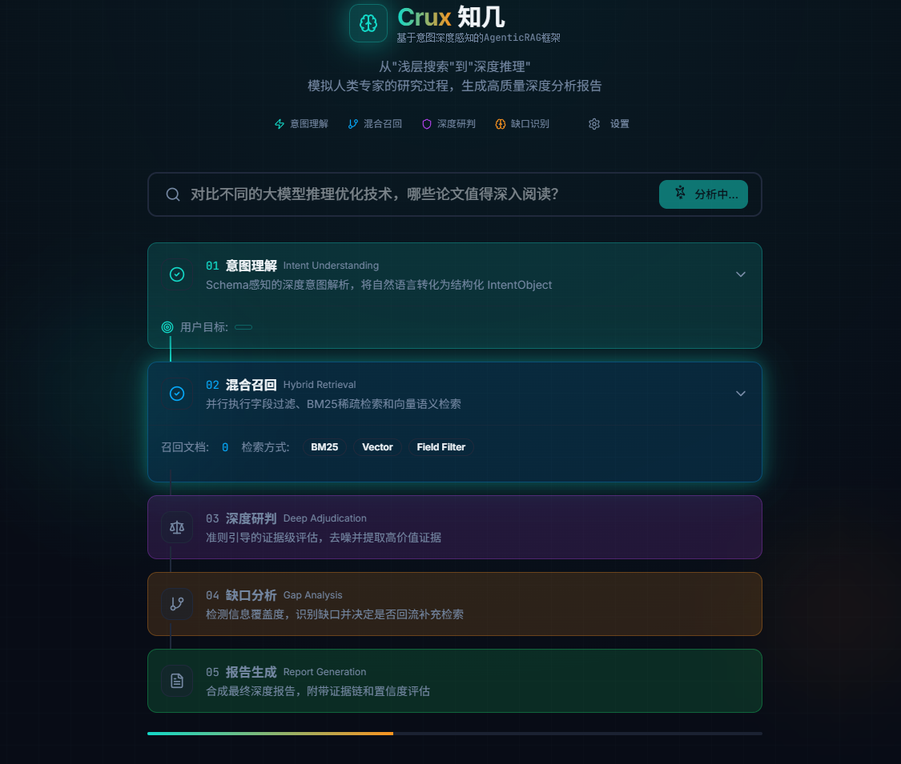

# Crux
An agentic RAG framework powered by deep intent understanding.



## 目录结构

```
src/crux/
├── __init__.py          # 主包入口
├── config.py            # 框架配置
├── state.py             # 全局状态定义 (AgentState)
├── graph.py             # 图编排逻辑 (AgentGraph)
│
├── utils/               # 通用工具箱
│   ├── base.py          # 节点基类 (BaseNode)
│   └── llm_client.py    # LLM 调用封装
│
├── modules/             # 核心业务模块（可独立优化）
│   ├── understanding/   # [模块1] 意图理解
│   │   ├── node.py      # 节点实现
│   │   ├── models.py    # IntentObject 等 Pydantic 模型
│   │   └── prompts.py   # 意图解析 Prompt
│   │
│   ├── retrieval/       # [模块2] 混合召回
│   │   ├── node.py      # 节点实现
│   │   └── tools.py     # 检索工具类
│   │
│   ├── adjudication/    # [模块3] 深度研判
│   │   ├── node.py      # 节点实现
│   │   ├── judge.py     # 研判逻辑核心
│   │   └── prompts.py   # 研判 Prompt
│   │
│   └── strategy/        # [模块4] 缺口分析与报告
│       ├── node.py      # GapAnalysisNode + ReportNode
│       └── prompts.py   # 缺口分析 Prompt
│
├── data/loaders/        # 数据加载器
│   ├── base.py          # 抽象基类
│   ├── json_loader.py   # JSON 加载 (已实现)
│   ├── csv_loader.py    # CSV 加载 (接口预留)
│   └── vector_db.py     # 向量DB (接口预留)
│
├── schemas/             # 数据结构配置
│   ├── base.py          # Schema 基类
│   └── paper_schema.py  # 论文 Schema
│
└── context/
    └── builder.py       # 上下文构建器
```

---

## 核心设计

### 1. 模块独立化

每个模块独立目录，包含 node.py、prompts.py、models.py：

| 模块 | 路径 | 功能 |
|------|------|------|
| understanding | [modules/understanding/](file:///g:/Projects/Crux/src/crux/modules/understanding/) | 解析用户意图，生成 IntentObject |
| retrieval | [modules/retrieval/](file:///g:/Projects/Crux/src/crux/modules/retrieval/) | 混合检索召回 (BM25 + Vector) |
| adjudication | [modules/adjudication/](file:///g:/Projects/Crux/src/crux/modules/adjudication/) | 证据深度研判 |
| strategy | [modules/strategy/](file:///g:/Projects/Crux/src/crux/modules/strategy/) | 缺口分析 + 报告生成 |

### 2. 数据层抽象

支持多种数据源，通过工厂函数 `get_data_loader()` 获取：

- **JSON** - 已实现，使用 `data/ir_papers.json`（354篇论文）
- **CSV** - 接口预留，支持 Pandas
- **向量数据库** - 接口预留（Milvus/Qdrant/ES）

### 3. Schema 参数化

Schema 从 prompt 中剥离，动态注入：

- [PaperSchema](file:///g:/Projects/Crux/src/crux/schemas/paper_schema.py): 论文数据
- 可扩展新 Schema 类型（新闻、日志等）

---

## 验证结果

### 导入测试
```
Import successful
```

### Demo 运行
```
[JsonLoader] 加载了 354 条数据
[JsonLoader] 过滤后剩余: 354 条
[JsonLoader] 召回: 50 条
[REPORT] 生成完成，包含 50 条证据。
```

### 样例输出
检索到的论文包括：
- Nested Browser-Use Learning for Agentic Information Seeking
- DrugRAG: Enhancing Pharmacy LLM Performance
- FastV-RAG: Towards Fast and Fine-Grained Video QA
- LOOPRAG: Enhancing Loop Transformation Optimization
- 等 50 篇 RAG 相关论文

---

## 使用方式

```python
from src.crux import AgentGraph, CruxConfig

config = CruxConfig(
    data_source_type="json",
    data_source_path="data/ir_papers.json",
    schema_type="paper",
)

graph = AgentGraph(config)
result = graph.invoke({"user_query": "找关于RAG的论文"})
print(result["final_report"])
```

---

## 后续工作

1. 各节点负责人可独立优化对应文件
2. 实现真实 LLM 调用（设置 `mock_llm=False`）
3. 补充 CSV 和向量数据库加载器实现
4. 添加更多 Schema 类型（新闻、日志等）
