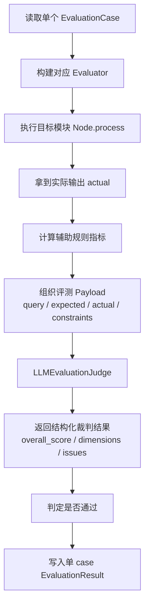
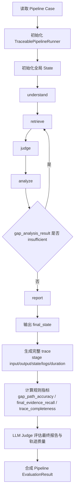
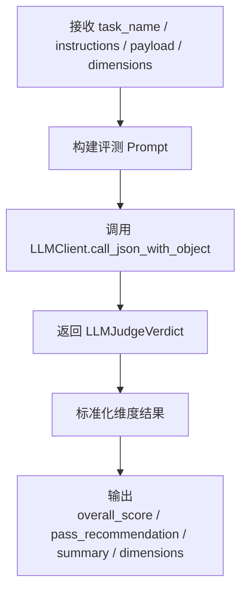
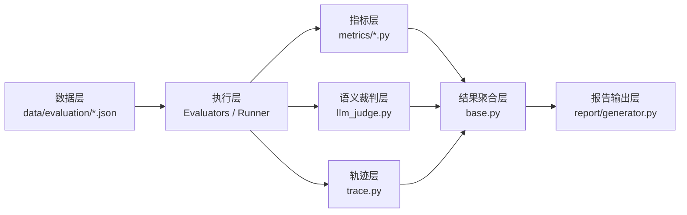

# Crux 评估框架流程图

## 1. 总体流程

```mermaid
flowchart TD
    A[开始: 触发评估 CLI 或 CI] --> B[加载评测数据集<br/>data/evaluation/*.json]
    B --> C[解析 EvaluationCase]
    C --> D{评估类型}

    D -->|模块级评估| E[选择模块评测器<br/>Understanding / Retrieval / Adjudication / Strategy]
    D -->|端到端评估| F[选择 PipelineEvaluator]

    E --> G[构建评测配置 CruxConfig]
    F --> G

    G --> H{是否存在 Stub}
    H -->|是| I[注入 StubLLMClient / InMemoryDataLoader]
    H -->|否| J[使用真实 LLMClient]

    I --> K[执行模块或流水线]
    J --> K

    K --> L[收集结构化输出]
    L --> M[计算规则指标<br/>Recall@K / F1 / Latency / Trace Completeness ...]
    M --> N[调用 LLM Judge 做语义评估]
    N --> O[融合规则指标 + LLM 评分]
    O --> P[生成 EvaluationResult]
    P --> Q[聚合为 EvaluationSummary]
    Q --> R[导出 JSON / Markdown 报告]
    R --> S[结束]
```

## 2. 模块级评估流程



## 3. 端到端流水线评估流程



## 4. LLM Judge 内部流程



## 5. 评估框架分层结构



## 6. 使用建议

- 文档中直接粘贴第 1 张和第 3 张图，适合技术说明。
- 汇报场景优先使用第 1 张和第 5 张图，信息密度更合适。
- 如果要做 PPT，我建议把第 1 张图再压缩成“输入 -> 执行 -> 评分 -> 报告”四段式。
